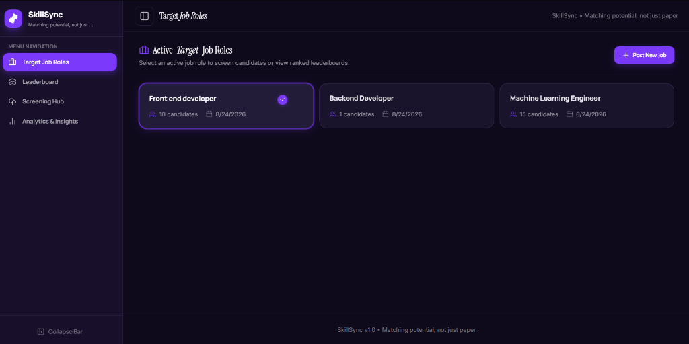
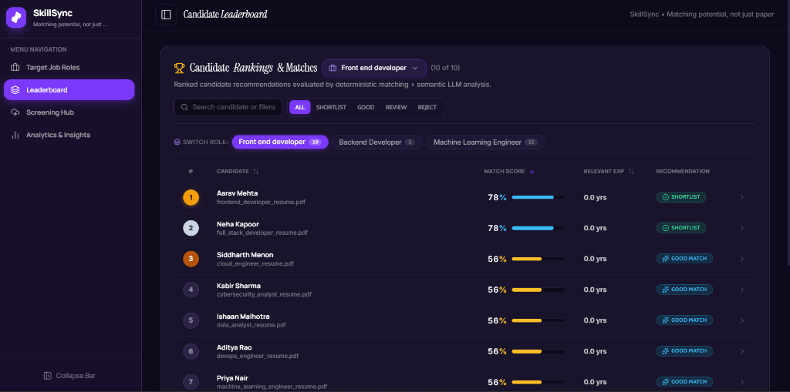
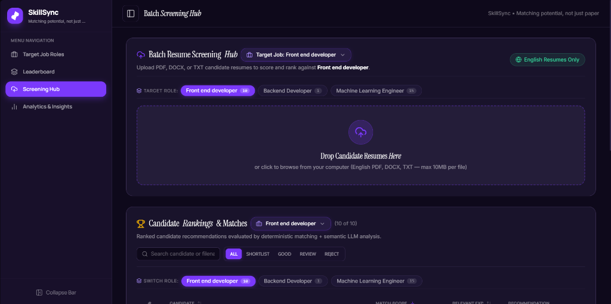
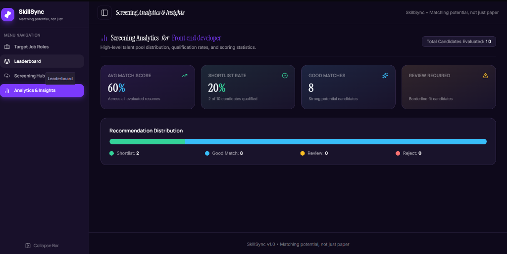
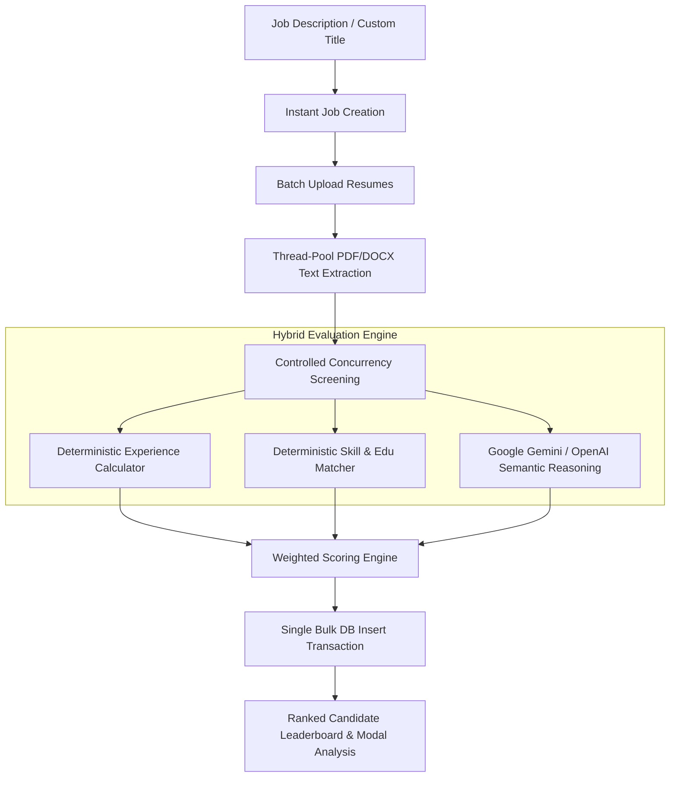

# Smart Resume Screener

**Smart Resume Screener** is an AI-powered, production-grade candidate screening application designed to help recruiters process, evaluate, rank, and analyze candidate resumes against job descriptions at scale.

The application features a hybrid evaluation engine combining **deterministic rule-based parsing** (elapsed calendar month experience calculations, degree hierarchy matching, domain skill overlap) with **generative AI semantic reasoning** (Google Gemini & OpenAI GPT-4o) to deliver fast, highly accurate, and non-biased candidate assessments.

---

## 🌟 Key Features

- **Multi-Format Resume Processing**: Upload PDF (`.pdf`), Word (`.docx`), or Plain Text (`.txt`) resumes individually or in batch uploads.
- **Automated Non-Blocking Extraction**: Multi-threaded document text parsing (`asyncio.to_thread`) that preserves full resume details without blocking backend performance.
- **Hybrid AI & Deterministic Evaluation**:
  - **Deterministic Engine**: Calculates exact elapsed calendar work experience (handling overlapping jobs, current roles, and conservative year-only ranges) and degree hierarchy fit.
  - **Semantic AI Engine**: Leverages Google Gemini / OpenAI to analyze domain context, project quality, responsibilities, and qualitative alignment.
- **Multi-Dimension Weighted Scoring**: Evaluates candidates across 4 key dimensions:
  - 🎯 **Skills Overlap (40%)**: Mandatory, preferred, and bonus technical skills matching.
  - 🧠 **Semantic Relevance (30%)**: Deep AI reasoning on domain relevance and project impact.
  - 💼 **Work Experience (20%)**: Merged non-overlapping total and domain-relevant experience duration.
  - 🎓 **Educational Fit (10%)**: Degree level requirement verification and STEM field relevance.
- **Ranked Leaderboard & Candidate Deep-Dives**: View ranked candidate lists sorted by match percentage with detailed modals showing strengths, gaps, missing skills, and AI justifications.
- **Instant Job Role Saving**: Sub-millisecond job creation using deterministic profile extraction without blocking on LLM calls.
- **Bulk Database Operations & High Throughput**: Bounded parallel screening concurrency (`asyncio.Semaphore`) and single-transaction bulk database writes (`db.add_all()`).
- **Comprehensive API & Security**: Secured API key authentication (`X-API-Key`), rate-limiting (`SlowAPI`), and OpenAPI Swagger documentation.

---

## 🖼️ Application Screenshots

### 1. Active Target Job Roles Dashboard


### 2. Ranked Candidate Leaderboard & Matches


### 3. Batch Resume Screening Hub


### 4. Screening Analytics & Insights


---

## ⚙️ Application Workflow



---

## 📐 Scoring Methodology

Candidates are evaluated across four weighted dimensions. The scoring criteria strictly match the backend implementation in `matcher.py`:

| Dimension | Weight | Description |
| :--- | :---: | :--- |
| **Skills Match** | **40%** | Direct match ratio of required, preferred, and bonus technical skills. |
| **Semantic Relevance** | **30%** | LLM assessment of candidate responsibilities, project impact, and domain fit. |
| **Experience Relevance** | **20%** | Exact calendar duration of relevant work experience vs. target job requirement. |
| **Educational Fit** | **10%** | Degree level hierarchy (PhD > Master's > Bachelor's > Diploma) and field relevance. |

$$\text{Final Match Score} = (0.40 \times \text{Skill}) + (0.30 \times \text{Semantic}) + (0.20 \times \text{Experience}) + (0.10 \times \text{Education})$$

---

## 🛠️ Technology Stack

### Client-Side (Frontend)
- **Framework**: React 19 + Vite 8
- **Styling**: Tailwind CSS v4 (Dark Theme & Dynamic UI)
- **Animations**: Framer Motion 13
- **Icons**: Lucide React 1.33
- **HTTP Client**: Native Fetch API with response validation

### Server-Side (Backend)
- **Language**: Python 3.12+
- **API Framework**: FastAPI 0.111+ & Uvicorn 0.30+
- **Data Validation**: Pydantic v2 & Pydantic-Settings
- **Rate Limiting**: SlowAPI 0.1.9

### AI & Document Processing
- **AI Models**: Dual Support — Google Gemini (`gemini-2.5-flash`, `gemini-3.6-flash`) & OpenAI (`gpt-4o`, `gpt-3.5-turbo`)
- **Document Extractors**: PyPDF2 3.0+ & python-docx 1.1+

### Database & ORM
- **Database**: SQLite (Development) / PostgreSQL (Production)
- **ORM**: SQLAlchemy 2.0+ with `PortableUUID` & Alembic 1.13+ migrations
- **Query Optimization**: Compound database index `ix_match_results_job_score` on `(job_id, final_score)`

---

## 📁 Project Structure

```text
smart-resume-screener/
├── backend/
│   ├── app/
│   │   ├── api/v1/         # FastAPI endpoints (/jobs, /screen, /candidates, /health)
│   │   ├── core/           # Config, database setup, rate limiter, API key auth
│   │   ├── models/         # SQLAlchemy DB models (Job, MatchResultDB)
│   │   ├── schemas/        # Pydantic schemas for profiles, experience, and match outputs
│   │   └── services/       # Core business logic:
│   │       ├── experience_calculator.py  # Elapsed month experience calculation
│   │       ├── llm.py                    # Gemini & OpenAI LLM integration & fast parsers
│   │       ├── matcher.py                # Deterministic scoring algorithms
│   │       ├── parser.py                 # Multi-threaded PDF/DOCX/TXT extractors
│   │       └── screener.py               # Candidate screening orchestrator
│   ├── tests/              # Pytest verification suite (86+ unit & E2E test cases)
│   ├── alembic/            # Database schema migration files
│   ├── requirements.txt    # Backend Python dependencies
│   └── .env.example
├── frontend/
│   ├── src/
│   │   ├── components/     # UI Components (JobManager, ResumeUploader, Leaderboard, Modal)
│   │   ├── api.js          # REST API client helper
│   │   ├── App.jsx         # Main application container
│   │   └── index.css       # Tailwind CSS design system tokens
│   ├── package.json        # Frontend Node dependencies
│   └── vite.config.js
├── README.md
└── vercel.json
```

---

## 🚀 Setup & Installation

### Prerequisites
- **Python**: `3.11` or `3.12`
- **Node.js**: `18+`
- **API Key**: Google Gemini API key or OpenAI API key

---

### 1. Backend Setup

```bash
cd backend

# Create & activate virtual environment
python -m venv venv

# Windows (PowerShell):
.\venv\Scripts\Activate.ps1
# macOS/Linux:
source venv/bin/activate

# Install dependencies
pip install -r requirements.txt

# Configure environment variables
cp .env.example .env
```

Edit `backend/.env` with your API configuration:
```ini
LLM_PROVIDER=gemini
GEMINI_API_KEY=your_gemini_api_key
# Or use OpenAI:
# LLM_PROVIDER=openai
# OPENAI_API_KEY=your_openai_api_key
DATABASE_URL=sqlite:///./smart_resume_screener.db
```

Start the FastAPI backend server:
```bash
uvicorn app.main:app --reload --port 8000
```
- API Endpoint: `http://localhost:8000/api/v1`
- Swagger API Documentation: `http://localhost:8000/docs`

---

### 2. Frontend Setup

In a new terminal tab:
```bash
cd frontend

# Install Node dependencies
npm install

# Start Vite development server
npm run dev
```
- Frontend Application: `http://localhost:5173`

---

## 🧪 Running Automated Tests

The backend includes a unit test suite covering experience calculations, candidate matching, pagination, reliability, and end-to-end API flows:

```bash
cd backend
venv\Scripts\pytest tests/
```

---

## 📡 API Reference Overview

| Method | Endpoint | Description |
| :--- | :--- | :--- |
| `GET` | `/api/v1/health` | Service health check |
| `POST` | `/api/v1/jobs` | Create a target job description (Instant LLM-free extraction) |
| `GET` | `/api/v1/jobs` | List all created job roles with candidate counts |
| `GET` | `/api/v1/jobs/{id}` | Retrieve specific job details |
| `POST` | `/api/v1/jobs/{id}/screen` | Upload & screen multiple resumes against job (Bounded parallel LLM calls) |
| `GET` | `/api/v1/jobs/{id}/candidates` | Get ranked candidate leaderboard for job |
| `GET` | `/api/v1/candidates/{id}` | Get complete candidate evaluation detail (skills, strengths, gaps, reasoning) |

---

## 🛡️ Security & Performance Highlights

- **API Security**: Endpoint protection using `X-API-Key` headers and IP rate-limiting via SlowAPI.
- **Zero-Secret Exposure**: Strict `.gitignore` rules preventing `.env` or credential leakage.
- **Fast Execution**:
  - **Job Creation**: Sub-millisecond execution (`~12ms`).
  - **Thread-Pool PDF Extract**: Parallel non-blocking document reads.
  - **Bulk Database Commits**: Reduces $N$ database transactions to 1 single bulk insert (`db.add_all()`).

---

## 👨‍💻 Author

Developed by **Abhijeet Singh**  
VIT-AP University  
GitHub Repository: [Smart Resume Screener](https://github.com/abhijeet-rx/smart-resume-screener)

---

## 📄 License

This project is open-source and available under the [MIT License](LICENSE).
